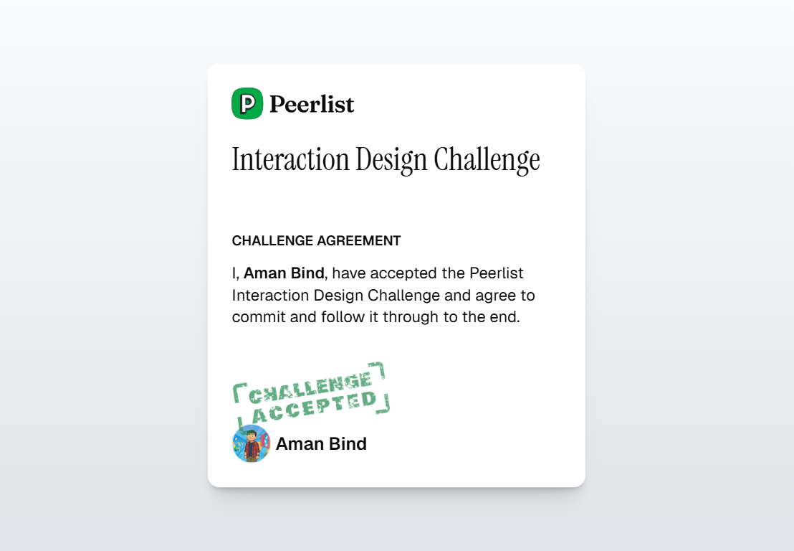

<div align="center">

<h2>Peerlist Challenge</h2>

<p>
  
</p>

<p>
  <a href="https://nextjs.org/">Next.js</a> • <a href="https://react.dev/">React</a> • <a href="https://nodejs.org/">Node.js</a>
</p>

</div>

### Overview
An open-source submission for the Peerlist coding challenge. The project is structured with the Next.js App Router and aims for clarity, performance, and a smooth developer experience.

### Features
- **Modern stack**: Next.js App Router, React, and Vite-like DX via `next dev`
- **Responsive UI**: Works across desktop and mobile
- **Developer friendly**: Clean structure, simple scripts, and clear docs
- **Open source**: Contributions welcome (see Contributing)

### Help Wanted: Theme Issue
There is a known issue/enhancement opportunity around the application theme (dark/light/system).
- Desired behavior: Persisted theme, system preference detection, accessible contrast ratios.
- Nice-to-have: Animated theme transition and SSR-safe rendering to avoid hydration flashes.

If you can solve or improve the theme, please open a PR! Mark it with the label "theme". See the Contributing section below.

### Tech Stack
- **Framework**: Next.js (App Router)
- **Language**: JavaScript (optionally TypeScript)
- **Styling**: Your choice (e.g., Tailwind CSS, CSS Modules, or styled-components)

### Project Structure
- `src/app` – Next.js App Router
- `src/app/day2` – Day 2 page implementation

### Getting Started
1) Install dependencies
```bash
npm install
```

2) Run the development server
```bash
npm run dev
```

3) Open the app
```
http://localhost:3000
```

### Available Scripts
- `npm run dev`: Start the dev server
- `npm run build`: Create a production build
- `npm run start`: Start the production server

### Contributing
Contributions are welcome! To contribute:
1. Fork the repository
2. Create a feature branch: `git checkout -b feat/your-feature`
3. Commit your changes: `git commit -m "feat: add your feature"`
4. Push to the branch: `git push origin feat/your-feature`
5. Open a Pull Request describing your changes and link to any related issues

For the theme work, include a brief before/after and screenshots or a short video if possible.

### Issue Labels
- `theme`: Issues and PRs related to dark/light mode and theming
- `good first issue`: Beginner-friendly contributions
- `help wanted`: Areas where community support is especially appreciated

### License
This project is open source and available under the MIT License. You are free to use, modify, and distribute it.

### Acknowledgements
- Peerlist team and the community
- Open-source libraries that power this project

This is a [Next.js](https://nextjs.org) project bootstrapped with [`create-next-app`](https://github.com/vercel/next.js/tree/canary/packages/create-next-app).

## Getting Started

First, run the development server:

```bash
npm run dev
# or
yarn dev
# or
pnpm dev
# or
bun dev
```

Open [http://localhost:3000](http://localhost:3000) with your browser to see the result.

You can start editing the page by modifying `app/page.js`. The page auto-updates as you edit the file.

This project uses [`next/font`](https://nextjs.org/docs/app/building-your-application/optimizing/fonts) to automatically optimize and load [Geist](https://vercel.com/font), a new font family for Vercel.

## Learn More

To learn more about Next.js, take a look at the following resources:

- [Next.js Documentation](https://nextjs.org/docs) - learn about Next.js features and API.
- [Learn Next.js](https://nextjs.org/learn) - an interactive Next.js tutorial.

You can check out [the Next.js GitHub repository](https://github.com/vercel/next.js) - your feedback and contributions are welcome!

## Deploy on Vercel

The easiest way to deploy your Next.js app is to use the [Vercel Platform](https://vercel.com/new?utm_medium=default-template&filter=next.js&utm_source=create-next-app&utm_campaign=create-next-app-readme) from the creators of Next.js.

Check out our [Next.js deployment documentation](https://nextjs.org/docs/app/building-your-application/deploying) for more details.
